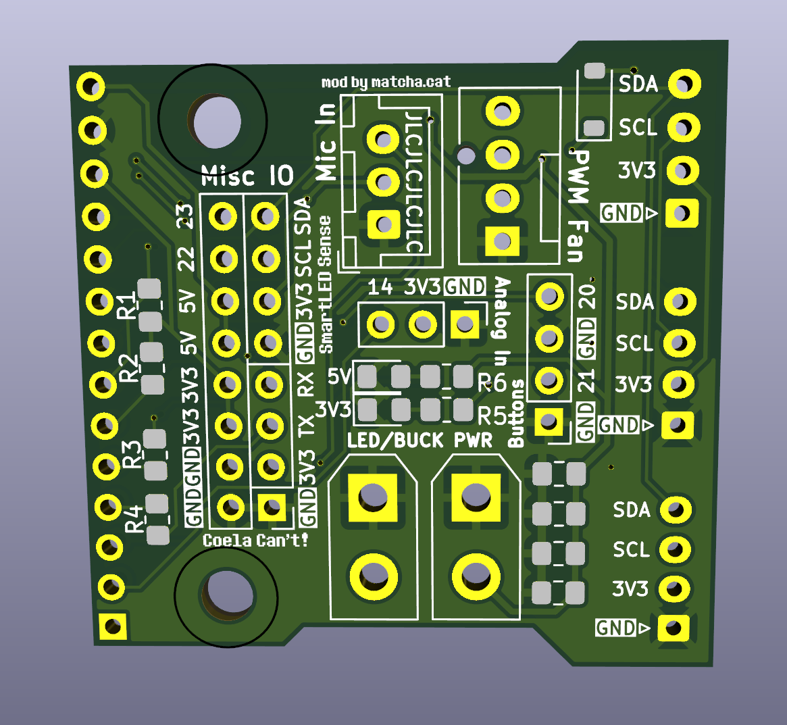
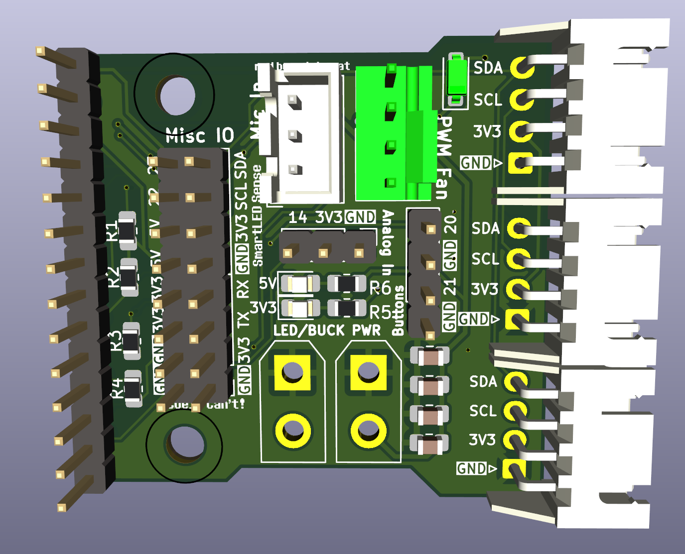

# SmartMatrixProtogenShield
SmartMatrix SmartLED Shield breakout for Protogen hardware

## General Information
The SmartLED Shield for the Teensy 4 is used as the backbone to this design. This allows you to use open-source code to easily implement if you decide against using ProtoTracer to display graphics on your Protogen!

The following information is pulled directly from their Crowd Supply page as a means of maintaining a local copy in case they take the posting down:
[SmartLED Shield for Teensy 4](https://www.crowdsupply.com/pixelmatix/smartled-shield-for-teensy-4)

## Controller Breakout

### Information
The controller breakout provides sensor connectivity, power distribution, and indication methods for power.

## Bill of Materials

| **RefDes**     | **Value**        | **Footprint** | **Quantity** | **Description**                                                    |
|----------------|------------------|---------------|--------------|--------------------------------------------------------------------|
| C1-C4          | 22µF             | SMD 0805      | 4            | Power filtering capacitors                                         |
| R1,R2,R5,R6    | 10KΩ             | SMD 0805      | 4            | Pull-up resistors                                                  |
| R3,R4          | 470Ω             | SMD 0805      | 2            | APA102 impedance matching resistors                                |
| LED1-2         |                  | SMD 0805      | 2            | Indicator LEDs. Type does not matter.                              |
| LEDPWR, BCKPWR | AMASS XT30U-F    | Through-Hole  | 2            | Power in and out                                                   |
| I2C1-4         | JST S4B-XH-A     | Through-Hole  | 4            | I2C Devices                                                        |
| J2             | JST B3B-XH-A     | Through-Hole  | 1            | Microphone in                                                      |
| J1             | Molex 47053-1000 | Through-Hole  | 1            | PC PWM Fan Header (Substitute for random 2.54 male header at will) |
| D1             | 1N4007 Diode     | SMD SOT-123   | 1            | Reverse current protection diode for the fan                       |

## Power Setup

### Powering the Teensy 4.0 for Programming
For programming the Teensy 4.0, the bottom VIN from VUSB trace needs to be cut to not provide power to the LED boards and cause damage while programming.

### Powering the Controller for Usage
To use the controller, 5V must be provided to the XT30 connector. Make sure you follow the standards for the XT30 polarity!

## Sensors/Peripherals

### Boop Sensor (APDS-9960)
The APDS-9960 is a Time-of-Flight sensor that uses an IR light to measure the distance to the object in front of it using the I2C communication protocol. This can be connected on either the Teensy I2C breakout or the ESP32 I2C breakout.

### 9-axis IMU (BNO055)
The BNO055 is a 9-axis IMU that can be used for stylistic effects on the protogen's displays. This can be connected on this Teensy breakout on the side.

### PWM Fan (Noctua NF-A4x10 5V PWM)
The NF-A4x10 5V PWM is a quiet and compact PWM fan that can be driven using the dedicated header on the breakout. If unable to source the Molex connector, any 2.54mm male header would work.

### MAX9814 Microphone
The MAX9814 electret microphone is a standard electret microphone with automatic gain compensation via an amplifier. This will pick up a varying range of sounds and not just your voice, so it is best to tune the software gain appropriately.

### Control Button
The control button is a simple button that allows you to toggle between faces. There is no analog filtering on the button with the kit as the button debouncing is handled in code within the ButtonHandler class.

### I2C OLED Display
The OLED display is a small display for mounting within the visor for the wearer to see. It is used to display the current face being displayed on the outside, status of a battery, or anything else you like. This will communicate over I2C with either the Teensy or the ESP32.

## Programming the Teensy

### Getting Started with ProtoTracer

#### Install Applications
- Install Visual Studio Code from here: [Visual Studio Code](https://code.visualstudio.com/)
- Install TeensyDuino from here: [TeensyDuino](https://www.pjrc.com/teensy/td_download.html)

#### Install Extensions
- Install PlatformIO IDE under the extensions in Visual Studio Code.
- Install C/C++ extension.

#### Download the Codebase
Download ProtoTracer from here: [ProtoTracer](https://github.com/coelacant1/ProtoTracer). You can use either the Zip download or clone it to a local Git repository.

## General Recommendations and Notes
- Do not use external power to the XT30 connector, unless it is 5V directly, the controller should be able to handle 4.5V to 5.5V but anything else is outside of specification.
- Do not short circuit the IO pins. Be careful about which pins are in use and are listed at the beginning of the guide.
- Be careful leaving the electronics in a humid environment.

## Images

### 3D View

### 3D View with Components

### Electrical Schematic

